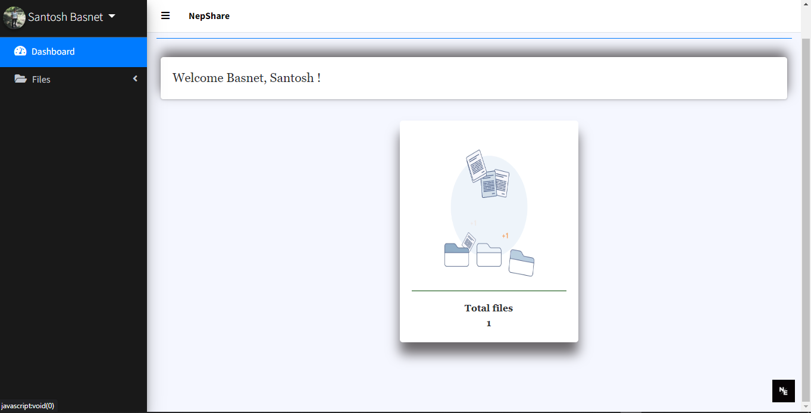
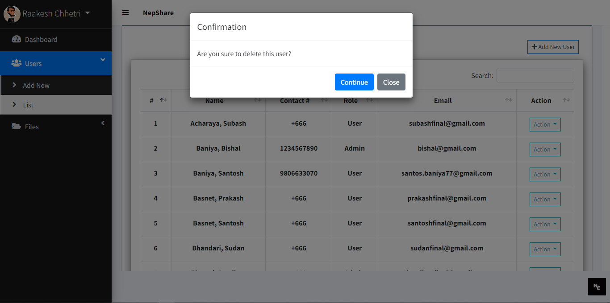

# NepShare - File Sharing System

<p align="center">
  Welcome to NepShare, your go-to file sharing system! This PHP and MySQL-based project offers a robust solution with both admin and user panels, allowing you to manage users and files seamlessly.
</p>

## Introduction

NepShare is a feature-rich file sharing system developed to simplify file management and sharing tasks. With both admin and user panels, it provides a comprehensive solution for creating, updating, and deleting users and files. Utilize the power of PHP and MySQL to build a secure and efficient file-sharing platform.

## Features

- **Admin Panel:** Manage users, files, and system settings effortlessly.
- **User Panel:** Upload, download, and manage your files with ease.
- **CRUD Operations:** Perform Create, Read, Update, and Delete operations on both users and files.
- **Secure Authentication:** Ensure secure access to your system with authentication features.

## Getting Started

To set up NepShare on your system, follow these steps:

1. **Clone the repository:**
    ```bash
    git clone https://github.com/soul-xettri/NepShare.git
    cd NepShare---File-Sharing-System-PHP-
    ```

2. **Database Configuration:**
    - Import the SQL schema from `database/nepshare.sql` into your MySQL database.
    - Configure database credentials in `config/database.php`.

3. **Run the Application:**
    - Start a PHP server (e.g., using `php -S localhost:8000`).
    - Open your browser and navigate to `http://localhost:8000`.

4. **Explore Admin and User Panels:**
    - Admin Panel: `http://localhost/file-sharing-system(NepShare)/`
    - User Panel: `http://localhost/file-sharing-system(NepShare)/`

## Admin Panel

The admin panel provides access to system management features:

- **Manage Users:** Create, update, and delete user accounts.
- **Manage Files:** View and delete files uploaded by users.
- **System Settings:** Configure system-wide settings.

## User Panel

The user panel empowers users with:

- **File Upload:** Upload files securely.
- **File Download:** Download files shared within the system.
- **File Management:** Organize and delete uploaded files.

## Contributing

Contributions are welcome! If you have suggestions for improvement, find bugs, or want to contribute new features, please submit a pull request or open an issue.

## License

This project is licensed under the MIT License.

Enjoy using NepShare for efficient and secure file sharing! 🚀

## Screenshots

For a visual overview of NepShare, refer to the screenshots provided below:

### 1) Register Page
<p align="center">
  
  <br />
</p>

### 2) Login Page
<p align="center">
  
  <br />
</p>

### 3) Admin Dashboard
<p align="center">
  
  <br />
</p>

### 4) User Dashboard
<p align="center">
  
  <br />
</p>

### 5) My Profile
<p align="center">
  
  <br />
</p>


### 6) Add New User 
<p align="center">
  
  <br />
</p>

### 7) User Lists
<p align="center">
  
  <br />
</p>

### 8) View User Profile
<p align="center">
  
  <br />
</p>

### 9) Edit User
<p align="center">
  
  <br />
</p>

### 10) Delete User
<p align="center">
  
  <br />
</p>

### 11) Add File 
<p align="center">
  
  <br />
</p>
<p align="center">
  
  <br />
</p>

### 12) List My Files
<p align="center">
  
  <br />
</p>

### 13) Edit Files
<p align="center">
  
  <br />
</p>

### 14) View File
<p align="center">
  
  <br />
</p>

### 15) Share Files
<p align="center">
  
  <br />
</p>

### 16) Create URL Link and Share
<p align="center">
  
  <br />
</p>


